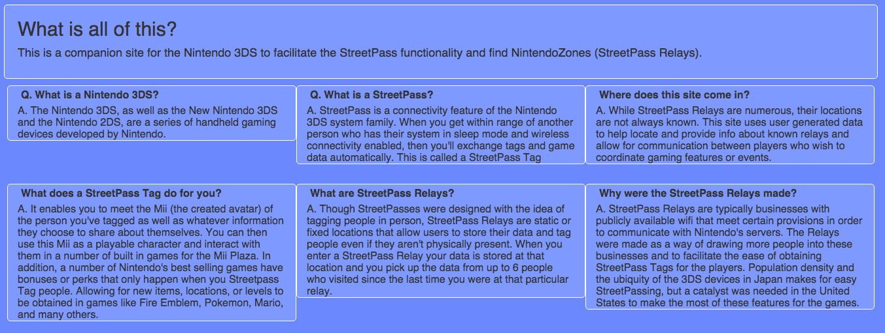
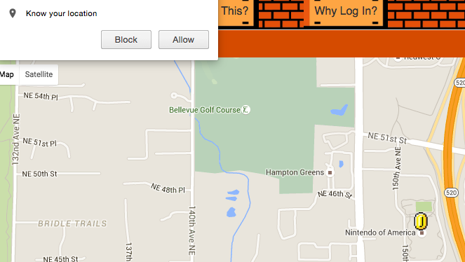
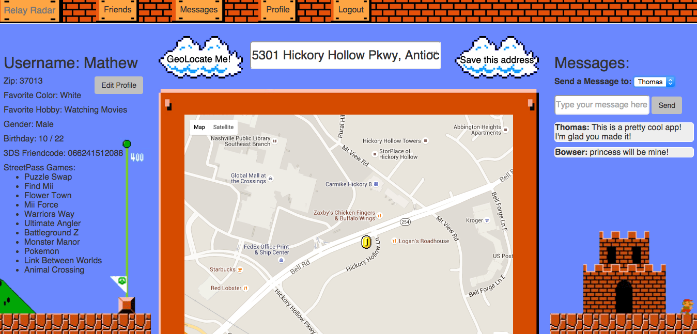
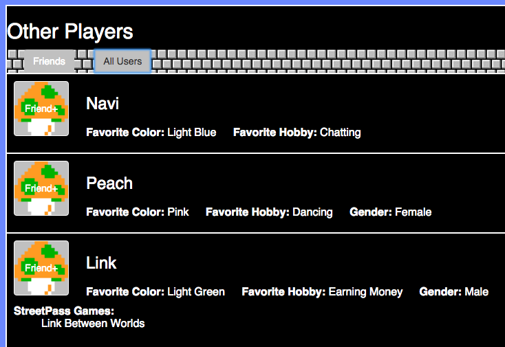

# StreetPass Relay Radar
### Companion site for the Nintendo 3DS family

## About
This was my Front-End Capstone for Nashville Software School, but I will continue to work and develop it as a side project

Main Goals:
To heighten a 3DS user's experience by providing a support site for games and to find friends.

To create a user generated map of StreetPass Relays (usable whether or not you log in)

Each user that logs in gets a unique screenname and profile with your games, goals, info, or whatever you choose to share.

You can view others shared profile information and add them as friends.
Friends can message each other to combine game efforts, coordinate StreetPasses, or just have fun!

## Requirements
Since it's a command line app, you will need access to your terminal.
You will also need Git and NPM

## Installing
1. In the directory you want to install, Git Clone this repo
2. Change Directory into the cloned repo
3. In that main directory run `npm install`

## Running
1. Once install is complete run `npm start`
2. Open a browser tab to http://localhost:3000/

## Usage

This app is best used with location detection allowed

Without loggin in you are still able to browse the Google map and search for address in the search box. But to access the community you will need to create an account or log in.

Logging in allows you to see messages that friends have sent you, update your profile, and find other friends.

There are two tabs in the other users section, those added as friends and all others.

## Future Plans
Next Steps:
Ability to delete messages from other users

Make a 'provisional friend' section until they are confirmed.

Add info-windows to the markers

Ability to check into particular relays

Sorting friends/others based on profile information

